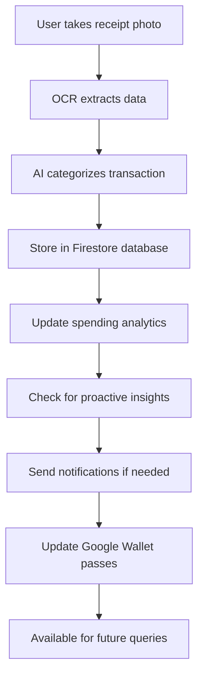
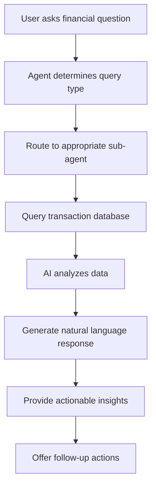

# Aegis Financial Assistant - Use Cases

This document outlines the primary use cases and user scenarios for the Aegis Financial Assistant platform, demonstrating how users interact with the system and the value it provides.

## 🎯 Overview

Aegis is an AI-powered financial assistant that helps users manage their finances through intelligent receipt processing, spending analysis, and proactive insights. The platform combines OCR technology, AI analysis, and personalized recommendations to provide a comprehensive financial management experience.

## 👥 Target Users

- **Busy Professionals**: Need quick financial insights without manual expense tracking
- **Budget-Conscious Individuals**: Want to optimize spending and find savings opportunities
- **Tech-Savvy Consumers**: Prefer automated solutions with smart integrations
- **Families**: Need to track household expenses and plan meals efficiently

## 🌟 Core Use Cases

### 1. Receipt Processing and Expense Tracking

**Scenario**: Sarah, a marketing manager, wants to track her business expenses without manual data entry.

**User Journey**:
1. **Receipt Capture**: Takes a photo of a restaurant receipt using the mobile app
2. **Automatic Processing**: Aegis uses OCR to extract transaction details (amount, merchant, items, date)
3. **Smart Categorization**: AI automatically categorizes the expense as "Business Meals"
4. **Digital Storage**: Transaction is stored in Firebase with searchable metadata
5. **Instant Feedback**: Receives confirmation with extracted details and category

**Value Delivered**:
- Eliminates manual data entry
- Ensures accurate expense categorization
- Provides instant digital records for tax purposes
- Reduces risk of lost receipts

**Technical Flow**:
```
Mobile App → Receipt Photo → Backend OCR → AI Categorization → Firestore Storage → User Notification
```

### 2. Intelligent Spending Analysis

**Scenario**: Mike wants to understand where his money goes each month and identify spending patterns.

**User Journey**:
1. **Natural Language Query**: Asks "What did I spend the most on last month?"
2. **Data Retrieval**: Aegis queries all transactions from the previous month
3. **AI Analysis**: Gemini AI analyzes spending patterns by category and merchant
4. **Insight Generation**: Provides breakdown showing "Restaurants: $450, Groceries: $320, Gas: $180"
5. **Actionable Recommendations**: Suggests "Consider meal prep to reduce restaurant spending"

**Sample Queries**:
- "Show me my spending trends by category"
- "Which store do I shop at most?"
- "How much did I spend on groceries in 2024?"
- "Find my largest purchases since January"

**Value Delivered**:
- Comprehensive spending visibility
- Trend identification without manual analysis
- Data-driven financial decisions
- Personalized recommendations

### 3. Proactive Financial Insights

**Scenario**: Emma receives automatic alerts about important financial patterns without having to actively check.

**User Journey**:
1. **Background Monitoring**: Aegis continuously analyzes Emma's spending patterns
2. **Pattern Detection**: Identifies that Netflix subscription increased from $15.99 to $17.99
3. **Insight Generation**: Creates alert about subscription price increase
4. **Push Notification**: Sends notification: "Netflix subscription increased by $2/month"
5. **Action Suggestions**: Recommends reviewing all subscriptions for potential savings

**Types of Proactive Insights**:
- Subscription price increases
- Unusual spending spikes
- Duplicate charges detection
- Budget threshold warnings
- Warranty expiration reminders
- Seasonal spending pattern changes

**Value Delivered**:
- Prevents overspending through early warnings
- Identifies money-saving opportunities
- Reduces financial surprises
- Promotes proactive financial management

### 4. Smart Recipe Suggestions

**Scenario**: Lisa wants meal ideas based on ingredients she already purchased.

**User Journey**:
1. **Grocery Receipt Upload**: Uploads grocery store receipts throughout the week
2. **Virtual Pantry Creation**: Aegis extracts ingredients from grocery purchases automatically
3. **Recipe Request**: Asks "What can I cook with what I have?"
4. **Pantry Analysis**: AI identifies available ingredients (tomatoes, chicken, onions, etc.)
5. **Recipe Generation**: Provides 3-5 recipe suggestions using available ingredients
6. **Shopping List**: Offers to create shopping list for missing ingredients

**Example Response**:
```
Based on your recent grocery purchases, I found these ingredients:
- Chicken breast, tomatoes, onions, rice, garlic

Here are 3 recipes you can make:
1. Chicken Fried Rice - Uses: chicken, rice, onions, garlic
2. Chicken Tomato Curry - Uses: chicken, tomatoes, onions, garlic  
3. Simple Chicken Stir-fry - Uses: chicken, onions, garlic

Missing ingredients for Chicken Fried Rice: soy sauce, eggs
Would you like me to create a shopping list?
```

**Value Delivered**:
- Reduces food waste by using existing ingredients
- Saves time on meal planning
- Integrates shopping and cooking decisions
- Promotes efficient grocery shopping

### 5. Google Wallet Integration

**Scenario**: David wants to track his budget goals and create digital passes for shopping.

**User Journey**:
1. **Budget Creation**: Sets monthly grocery budget of $400
2. **Digital Pass Generation**: Aegis creates Google Wallet pass showing current spending progress
3. **Real-time Updates**: Pass updates automatically as new grocery receipts are processed
4. **Shopping List Integration**: Creates wallet pass with shopping list and current pantry items
5. **Accessibility**: Can view budget status directly from phone's wallet app

**Pass Types**:
- Budget tracking passes (grocery, dining, entertainment)
- Shopping list passes with pantry integration
- Warranty tracking passes with expiration dates
- Savings goal progress passes

**Value Delivered**:
- Convenient budget monitoring without opening apps
- Real-time spending awareness during shopping
- Integrated digital wallet ecosystem
- Visual progress tracking

### 6. Calendar Integration for Financial Events

**Scenario**: Rachel wants to track warranty expirations and payment due dates.

**User Journey**:
1. **Purchase Detection**: Aegis detects electronics purchase from receipt
2. **Warranty Identification**: Extracts product details and identifies typical warranty period
3. **Calendar Event Creation**: Automatically creates calendar reminder 11 months later
4. **Proactive Reminders**: Receives notification about warranty expiring soon
5. **Action Planning**: Gets suggestions to contact manufacturer or purchase extended warranty

**Calendar Event Types**:
- Warranty expiration reminders
- Subscription renewal dates
- Bill payment due dates
- Seasonal expense planning (taxes, insurance)
- Savings goal milestones

**Value Delivered**:
- Never miss important financial deadlines
- Maximize warranty value through timely claims
- Better financial planning and preparation
- Integrated with existing calendar workflows

## 🔄 User Interaction Flows

### Complete Receipt-to-Insight Flow



### Conversational Analysis Flow



## 💡 Advanced Use Cases

### 1. Financial Health Monitoring

**Scenario**: Continuous monitoring of overall financial health with periodic reports.

- Monthly spending summaries with trend analysis
- Debt-to-income ratio tracking
- Savings rate calculations
- Financial goal progress monitoring
- Comparative analysis (this month vs. last month/year)

### 2. Tax Preparation Support

**Scenario**: Automated preparation of tax-relevant expense data.

- Business expense categorization and reporting
- Charitable donation tracking
- Medical expense compilation
- Home office expense identification
- Export capabilities for tax software

### 3. Family Financial Management

**Scenario**: Coordinated expense tracking for household management.

- Multiple family member receipt uploads
- Shared budget monitoring
- Allowance and spending limit tracking
- Family meal planning based on combined grocery purchases
- Coordinated savings goals

### 4. Travel Expense Management

**Scenario**: Specialized handling of travel-related expenses.

- Automatic travel expense categorization
- Currency conversion for international purchases
- Business vs. personal travel expense separation
- Travel budget monitoring
- Expense report generation

## 📊 Success Metrics

### User Engagement
- Receipt upload frequency
- Query interaction rates
- Proactive insight engagement
- Feature adoption rates

### Financial Impact
- Users reporting increased savings
- Reduced duplicate charges discovered
- Subscription optimization savings
- Budget adherence improvement

### Operational Excellence
- OCR accuracy rates
- Response time for AI analysis
- System uptime and reliability
- User satisfaction scores

## 🔮 Future Use Cases

### 1. Investment Tracking Integration
- Stock purchase receipt processing
- Portfolio performance analysis
- Investment goal tracking
- Market trend correlation with spending

### 2. Credit Score Optimization
- Spending pattern impact on credit scores
- Payment timing recommendations
- Credit utilization optimization
- Credit-building strategy suggestions

### 3. Predictive Financial Planning
- Future expense predictions based on patterns
- Seasonal spending forecasts
- Major purchase planning assistance
- Retirement savings optimization

## 🎯 Business Value Proposition

### For Individual Users
- **Time Savings**: Eliminate manual expense tracking
- **Financial Awareness**: Gain insights into spending patterns
- **Money Savings**: Identify optimization opportunities
- **Convenience**: Integrated digital financial management

### For Businesses
- **Employee Expense Management**: Automated business expense tracking
- **Compliance**: Accurate record-keeping for audits
- **Budget Control**: Real-time spending monitoring
- **Productivity**: Reduced administrative overhead

### For Families
- **Household Budget Management**: Coordinated family spending tracking
- **Meal Planning**: Efficient grocery shopping and cooking
- **Financial Education**: Teaching children about money management
- **Goal Achievement**: Collaborative savings and spending goals

This comprehensive use case document demonstrates how Aegis Financial Assistant provides value across multiple user scenarios, from basic expense tracking to advanced financial insights and integrations. The platform's AI-powered approach transforms traditional financial management into an intelligent, proactive experience that adapts to each user's unique needs and patterns.
